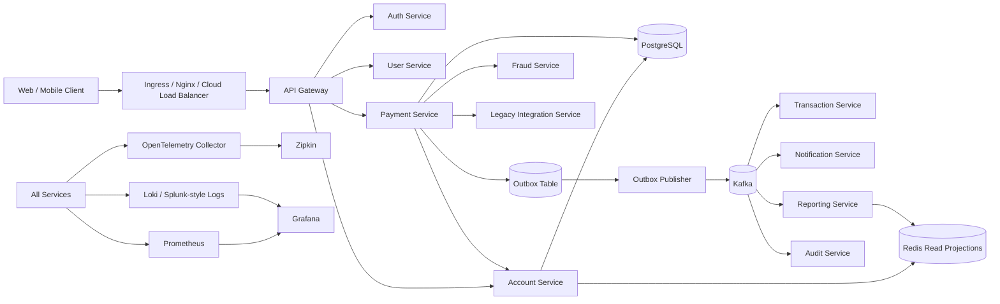
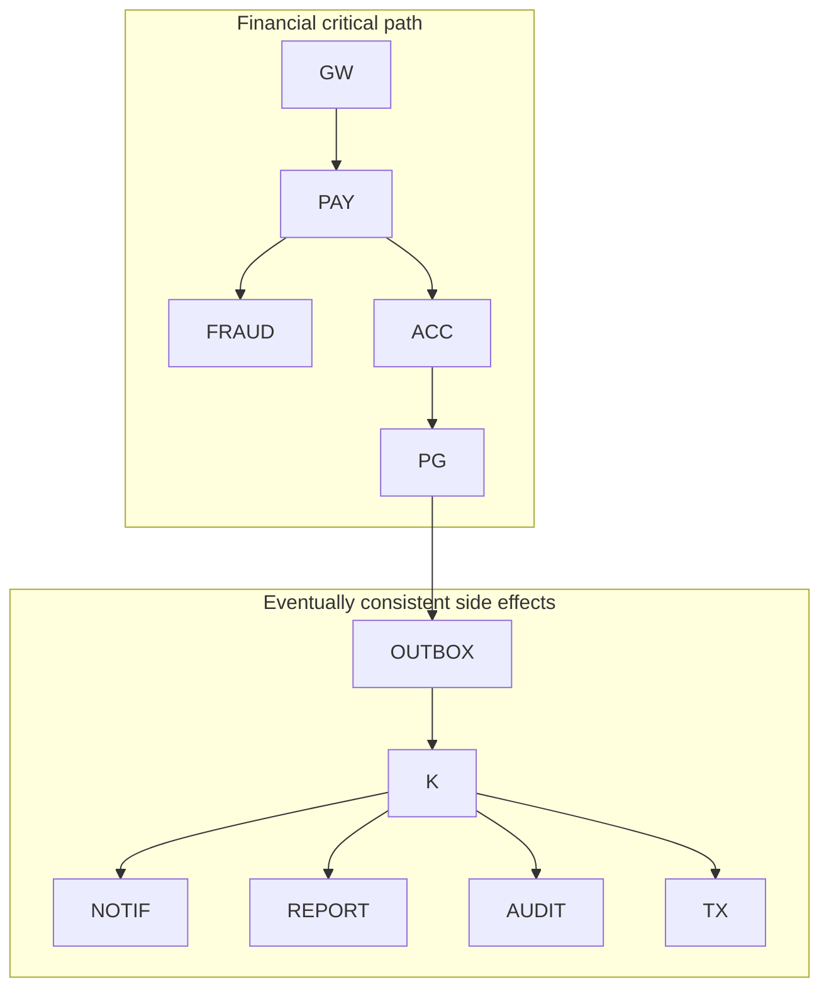
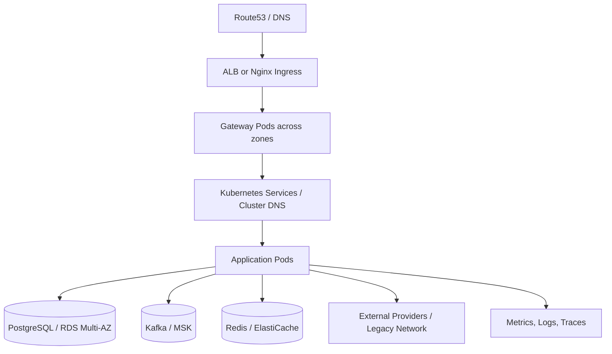
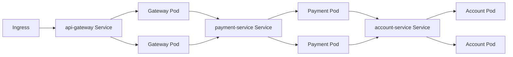

# 2. High-Level System Architecture

> **Documentation status model**
>
> * **Implemented:** observable in the current repository.
> * **Target production design:** the enterprise behavior this playground is designed to teach.
> * **Planned lab:** intentionally left as an extension exercise.
>
> Numerical scale, latency, and availability values are **illustrative engineering targets**, not claims about a real employer or historical production system.

## Overall architecture

## Synchronous versus asynchronous communication

Synchronous HTTP is used only when the caller needs an immediate business decision: authentication, ownership, account state, fraud decision, or posting response. Kafka is used for durable side effects whose failure must not roll back a committed transfer: notification, reporting, audit propagation, and downstream integration.

## Deployment topology

## Kubernetes topology

Kubernetes Service DNS replaces an application-level discovery registry for in-cluster workloads. Readiness determines whether a pod receives traffic; liveness determines whether Kubernetes should restart a stuck process. A downstream outage must not normally make liveness fail, because that can create a restart storm.

## Component responsibility matrix

| Component | Purpose | Key dependencies | Failure impact | Scaling strategy |
|---|---|---|---|---|
| API Gateway | Controlled edge, token verification, rate limit, routing, correlation | Auth keys, downstream services | Broad ingress impact; avoid business logic | Horizontal; route-level limits |
| Auth Service | Identity/token lifecycle | User identity store, key store | Login/refresh unavailable; existing tokens may continue | Horizontal; protect cryptographic/key operations |
| Account Service | Authoritative account state and posting boundary | PostgreSQL | Transfers and authoritative reads affected | Horizontal until DB/lock boundary dominates |
| Payment Service | Orchestrates transfer lifecycle and persists outbox | Account, fraud, PostgreSQL, Kafka publisher | New transfers affected; committed rows remain recoverable | Horizontal with idempotency and bounded pools |
| Fraud Service | Risk decision and reason codes | Rules/models/data | High-risk payments fail closed or enter review | Horizontal; low latency; model/rule versioned |
| Kafka | Durable event distribution | Brokers, storage, network | Async side effects delayed; outbox grows | Add partitions/brokers with ordering analysis |
| Redis | Low-latency derived views | Redis cluster | Dashboard degradation; never ledger loss | Cluster/shard; protect DB fallback |
| Notification | Provider abstraction and delivery workflow | Kafka, SMS/email providers | Delayed alerts, not payment rollback | Consumer concurrency bounded by partitions/providers |
| Reporting | Materialized business views | Kafka, analytical store | Stale reports | Independent consumer group and batch scaling |
| Audit | Immutable evidence | Kafka/storage | Compliance evidence delayed; local critical audit may need sync fallback | Append-oriented, retention tiering |
| Legacy Adapter | Anti-corruption layer for SOAP/mainframe | External systems | KYC/settlement degraded | Bulkhead per dependency; controlled concurrency |
| Observability | Detection and diagnosis | Agents/backends | Reduced diagnosability, not business correctness | Independent and sampled; avoid app blocking |

## Networking and trust boundaries

* Public traffic terminates TLS at a managed load balancer or ingress and is re-encrypted internally where policy requires.
* Application namespaces use NetworkPolicies to deny unnecessary east-west access.
* Databases, Kafka, and Redis use private subnets and security groups.
* Service identity is target-state mTLS or cloud workload identity; forwarding an end-user JWT alone is not sufficient.
* Egress to providers is allow-listed and separately monitored.

## Failure containment principles

1. Keep strongly consistent changes within the smallest practical transaction boundary.
2. Bound every remote call with a timeout.
3. Assign retry ownership to one layer.
4. Use bulkheads so one provider cannot exhaust shared threads or connections.
5. Preserve committed work in an outbox when Kafka is unavailable.
6. Degrade projections before risking the ledger database.
7. Expose intermediate states and reconcile them.
