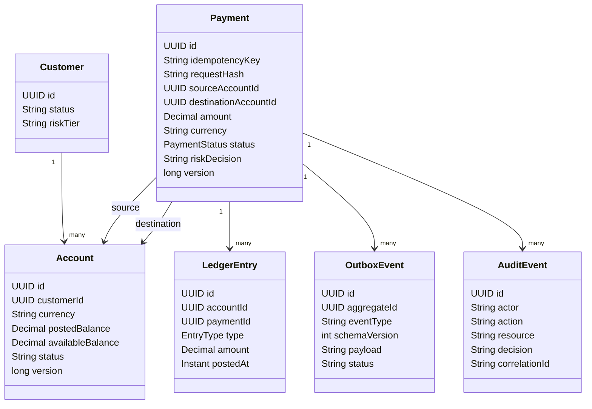
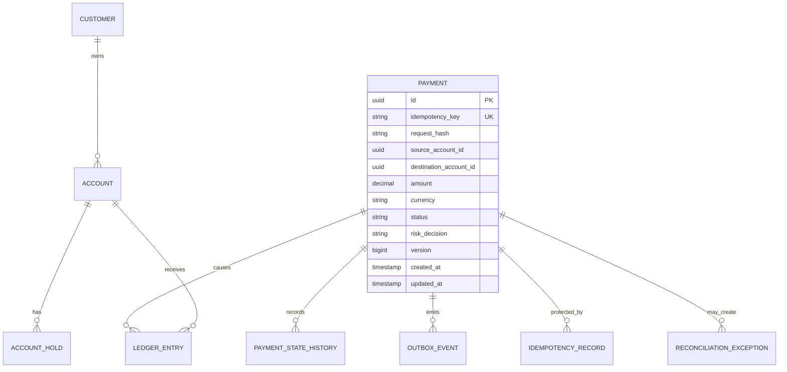

# 3. Domain Model

> **Documentation status model**
>
> * **Implemented:** observable in the current repository.
> * **Target production design:** the enterprise behavior this playground is designed to teach.
> * **Planned lab:** intentionally left as an extension exercise.
>
> Numerical scale, latency, and availability values are **illustrative engineering targets**, not claims about a real employer or historical production system.

## Bounded contexts

| Context | Owns | Does not own |
|---|---|---|
| Identity | Credentials, token sessions, refresh rotation | Account ownership rules |
| Customer/User | Customer profile and preferences | Ledger balance |
| Accounts/Ledger | Account lifecycle, available/posted balance, holds, postings | Notification delivery |
| Payments | Transfer intent, idempotency, workflow state, risk result | Provider implementation details |
| Fraud | Risk decision, reason codes, rule/model version | Financial posting |
| Notifications | Preferences, templates, provider attempts | Payment correctness |
| Reporting | Materialized analytical views | Authoritative transaction state |
| Audit | Immutable business/security evidence | Operational debug logs |
| Legacy Integration | Translation to external contracts | Domain model ownership |

## Aggregate model

## ER model: target state

## Core business rules

* Amount must be positive and represented using decimal arithmetic.
* Source and destination must be different and currency-compatible unless FX is explicit.
* Source account must be active, owned/authorized, and have sufficient available funds.
* An idempotency key is scoped to an authenticated principal and operation.
* Reusing a key with a different request hash is a conflict, not a replay.
* Debit and credit must either commit together within the ledger boundary or be represented by a recoverable saga with explicit states.
* Redis balance is never used for authorization.
* Every state transition is append-auditable; mutable current state is not the complete history.
* Fraud outage behavior is policy-dependent: high-risk fails closed/review; constrained low-risk degradation is explicit and measured.

## Domain events

| Event | Producer | Key | Consumers | Compatibility rule |
|---|---|---|---|---|
| `payment.initiated.v1` | Payment | paymentId/accountId | Fraud analytics, audit | Additive fields only |
| `payment.completed.v1` | Payment | accountId or paymentId | Notifications, reporting, transaction, audit | Stable envelope and semantic meaning |
| `payment.failed.v1` | Payment | paymentId | Audit, support projection | Reason codes versioned |
| `fraud.alert.raised.v1` | Fraud | customerId | Case management, audit | PII minimized |
| `customer.notification.requested.v1` | Payment/Notification orchestrator | customerId | Notification workers | Channel preferences resolved carefully |

## Aggregate boundaries and concurrency

The account/ledger aggregate protects funds. The payment aggregate protects workflow identity and state. The current playground uses deterministic pessimistic account-row locking for posting. A fuller production design would store double-entry ledger rows and compute or materialize balances from postings and holds.

## Invariants versus projections

| Invariant | Source of truth | Projection allowed? |
|---|---|---|
| No overspend | Ledger transaction and locks | No |
| One effect per idempotency key | DB unique constraint and request hash | No |
| Dashboard balance | Account/ledger | Yes, with `asOf` and version |
| Notification status | Notification store/provider response | Yes |
| Reporting totals | Event-derived analytical view | Yes, reconciled |
