# 13. Deployment Guide

> **Documentation status model**
>
> * **Implemented:** observable in the current repository.
> * **Target production design:** the enterprise behavior this playground is designed to teach.
> * **Planned lab:** intentionally left as an extension exercise.
>
> Numerical scale, latency, and availability values are **illustrative engineering targets**, not claims about a real employer or historical production system.

## CI/CD pipeline

```mermaid
flowchart LR
  PR[Pull Request] --> BUILD[Maven compile + unit tests]
  BUILD --> INT[Testcontainers integration tests]
  INT --> CONTRACT[Contract/schema compatibility]
  CONTRACT --> SEC[SAST, dependency, secret, IaC scans]
  SEC --> IMAGE[Immutable signed container image]
  IMAGE --> STAGE[Deploy staging]
  STAGE --> PERF[Smoke + performance + failure tests]
  PERF --> CANARY[Production canary]
  CANARY --> GATE[SLO/business metric gate]
  GATE --> FULL[Progressive rollout]
```

The current GitHub Actions workflow and Dockerfiles provide a foundation; full signing, provenance, contract gates, and environment promotion are target state.

## Docker and Compose

Docker Compose runs PostgreSQL, Redis, Kafka, Prometheus, Grafana, Loki, Zipkin, and Toxiproxy. It is for local learning, not a production HA topology. Images should run as non-root, use a read-only filesystem where possible, expose only necessary ports, and include JVM/container resource settings.

## Kubernetes

Deployments use readiness/liveness probes, resource requests/limits, graceful termination, HPA, and PodDisruptionBudget. Production adds NetworkPolicies, service accounts/workload identity, topology spread, anti-affinity, secret CSI, autoscaling guardrails, and policy enforcement.

## Release strategies

* **Rolling:** efficient default for compatible low-risk changes.
* **Canary:** sends limited traffic to a new version and gates on technical/business SLIs.
* **Blue-green:** fast routing rollback but duplicates environment cost and still requires database/event compatibility.

No strategy creates zero downtime by itself. Connection draining, readiness, in-flight work, schema compatibility, and stateful consumer behavior matter.

## Rollback

Rollback covers application, database compatibility, Kafka schemas, configuration, feature flags, and in-flight workflows. Use expand-and-contract migrations so the previous application remains operational. Never replay messages blindly after rollback.

## Feature flags

Flags provide controlled rollout and kill switches. They require ownership, default behavior, audit, expiry, test coverage for both paths, and safe local caching. A flag is not a substitute for a reversible database migration.

## Configuration management

Non-secret config is versioned, validated at startup, reviewed, staged, and exposed only through a sanitized configuration version. Secrets use a managed store. Dynamic refresh is restricted to properties proven safe to change at runtime.

## Release checklist

* Compatibility tests pass for API, database, and events.
* Flyway migration reviewed for lock/runtime impact.
* Dashboards and alerts include the new behavior.
* SLO/error-budget state permits release.
* Capacity and dependency budgets reviewed.
* Rollback and feature-flag paths tested.
* Runbook and owner updated.
* Canary shows no correctness, latency, saturation, or backlog regression.
