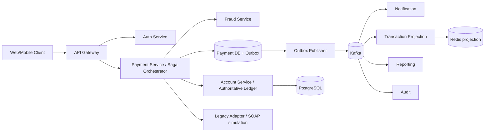

# Architecture

## Correctness boundary
The authoritative debit/credit operation remains inside the account ledger transaction. Payment orchestration holds workflow state and uses idempotency plus an outbox. Redis is only a derived view. Kafka is at-least-once; consumers must deduplicate.

## Service discovery
Local execution uses explicit URLs. Kubernetes uses stable Service names and cluster DNS; Eureka is intentionally omitted to avoid overlapping discovery systems.
