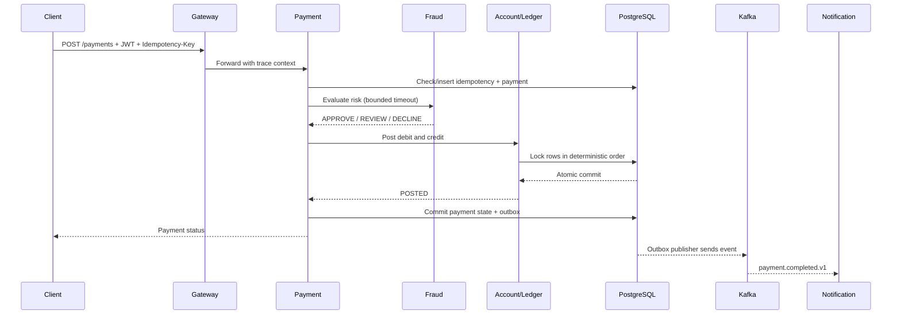

# Fund Transfer Flow

> **Documentation status model**
>
> * **Implemented:** observable in the current repository.
> * **Target production design:** the enterprise behavior this playground is designed to teach.
> * **Planned lab:** intentionally left as an extension exercise.
>
> Numerical scale, latency, and availability values are **illustrative engineering targets**, not claims about a real employer or historical production system.

## Goal

Customer submits an idempotent domestic transfer that posts atomically and emits an outbox event.

**Participants:** Client, Gateway, Payment, Fraud, Account, PostgreSQL, Kafka

## Happy path

1. Validate identity, authorization, input, and business preconditions.
2. Allocate a correlation ID and preserve a stable business identifier across retries.
3. Execute only the decisions required synchronously.
4. Persist the authoritative result before returning a terminal status.
5. Move non-critical side effects to durable asynchronous processing.

## Failure path

A dependency error is translated into a domain state, not an ambiguous generic success. High-risk or correctness-sensitive actions fail closed or enter review. Optional projections may degrade while the authoritative path remains protected.

## Retry path

The retry owner verifies idempotency, remaining time budget, retryable error classification, and downstream capacity. Exponential backoff includes jitter. Retries do not occur independently at gateway, client, and service layers.

## Timeout path

A timeout means the caller lacks an answer; it does not prove the operation failed. The caller queries by payment/idempotency key before repeating a command. Timeout-after-commit is an explicit chaos test.

## Recovery path

Recovery uses persisted workflow state, outbox backlog, retry topics, DLQ/operator review, and reconciliation queries. Every recovery action is idempotent and auditable.

## Operational evidence

* Endpoint and dependency p95/p99 latency.
* Trace waterfall showing where time was spent.
* Business state age and stuck-state count.
* Idempotency conflicts and duplicate suppressions.
* Outbox age, consumer event age, retry depth, and DLQ growth.
