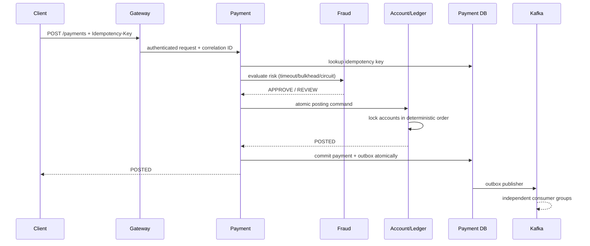

# Transfer sequence

```mermaid
sequenceDiagram
 participant C as Client
 participant G as Gateway
 participant P as Payment
 participant F as Fraud
 participant A as Account/Ledger
 participant DB as Payment DB
 participant K as Kafka
 C->>G: POST /payments + Idempotency-Key
 G->>P: authenticated request + correlation ID
 P->>DB: lookup idempotency key
 P->>F: evaluate risk (timeout/bulkhead/circuit)
 F-->>P: APPROVE / REVIEW
 P->>A: atomic posting command
 A->>A: lock accounts in deterministic order
 A-->>P: POSTED
 P->>DB: commit payment + outbox atomically
 P-->>C: POSTED
 DB->>K: outbox publisher
 K-->>K: independent consumer groups
```
